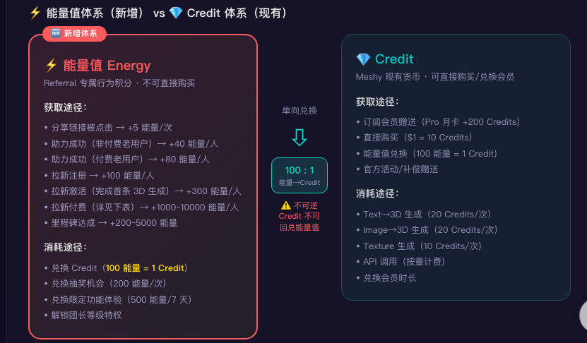

# For demo

# **Part 3：设计 Meshy的Referral方案\+实验设计\+Vibe Coding**

## 零、活动前提 

3D 生成是典型的高计算成本业务，单次 Text\-to\-3D 推理的 GPU 成本显著高于文本或 2D 图像生成。Referral 机制的本质是以边际成本撬动边际收入，但在高成本场景下极易陷入"薅完奖励即流失"的陷阱，，导致拉新数量与真实商业价值脱节。因此，Referral 体系的搭建需满足以下前提：以付费订阅转化为唯一北极星指标，在 ROI 达标与 DAU 正向的双重约束下，最大化拉新规模。

即，

1. 经济约束：单用户获客成本（CAC）须被其生命周期订阅收入覆盖，确保 ROI 达标；

2. 质量约束：拉新带来的用户须形成持续使用习惯，DAU 呈正向趋势，避免"虚假繁荣"；

3. 规模约束：在约束成立的前提下，最大化拉新数量。

## **一、机制设计 **

1. **增长循环模型：**在原有“激励型邀请”与“内容传播型”基础上，**新增“积分商城型”维度。**
原因：Meshy 的 3D 资产天然具备“生成即内容，内容即广告”的属性。激励型邀请可有效驱动用户主动分享创作成果；内容传播型则依托用户在社交平台自发展示作品并附带推荐链接，形成低成本、高信任度的自然流量闭环。新增的积分商城型，则将浅层分享行为（如转发、浏览）量化积分，并与现有 Credit 体系打通，实现行为激励与消费转化的良性联动。

2. **Referral的激励体系设计**

    1. 激励结构：双向激励

    2. 参与门槛：注册过meshy账号 

    3. 激励内容：

        1. 团员侧还是保留原有的激励，首月1美元\+次月50% off；

        2. 团长侧做以下差异优化：

            1. 激励模型中新增【助力】维度

                1. 当好友点击referral链接后，分为两种状态：拉新\(全新用户激活注册\)或助力\(已注册用户回访\)。本referral 激励机制将增加：助力的激励模型，即助力成功在本机制中同样计入激励大奖的进度条，但会采用差异化权重系数，既保障老用户召回对DAU的贡献，又通过回后的二次曝光将其导向新一轮referral 活动，开启下层裂变。

                2. 对0\-1获客阶段的AI工具，沉默用户召回成本仅为新客获取的1/5\-1/3。助力轨不仅直接拉升DAU，更重要的是通过「被助力者登录首屏弹出专属referral 入口」的设计，将其转化为新团长，形成下层裂变闭环。

            2. 采取千人千面的【分层动态奖励】

                1. 动态分层奖励更能根据好友侧不同付费的行为深度给到差异化激励，从而获得更高质量的用户，且对活动的成本把控更加清晰。
                价值数额折算将基于好友首单ARPU和预估LTV动态计算。

                \*\*\* 示意图内现金可以理解为原meshy体系下的credit

            3. 新增基于行为的里程碑式【阶梯激励】

                1. 里程碑式的阶梯激励是针对团长侧拉新行为深度做到即时反馈和目标感，浅层的分享和助力也可以有用，由此也需要新增一套更底层的数值体系，区别于现在meshy的credit体系（可以直接兑换会员），这套新的体系暂时命名成能力值体系，一定数量的能量值可以兑换credit。

                2. 能量值体系作为Referral的「行为燃料」，与Credit体系解耦，既能激励浅层分享行为\(能量值即时到账\)又避免直接发放Credit导致的财务风险。能量值Credit的单向兑换，确保用户最终仍需回流到Meshy核心消费场景。

            4. 奖励发放时序与成本ROI 

                - 能量值即时到账：满足心理学「即时反馈」需求，让用户在分享后秒级看到回报

                - Credit T\+7 发放：设置退款观察期，避免「付费→领取奖励→退款」的羊毛套利

                - 里程碑 T\+14 确认：大奖池（如 $100 Credit \+ 大使身份）需确认用户真实留存后才解锁

            假设基准：

            - Meshy Pro 定价：$10/月 = 1000 Credits → 1 Credit = $0\.01

            - 能量值兑换汇率：100 能量值 = 1 Credit

            - 平台算力边际成本 = Credit 面值 × 30%

        对比Paid CAC，Referral 不是「更便宜的获客」，而是「现金流更友好、用户质量更高、LTV 更优」的结构性优势。

3. Referral 项目流量来源

    1. 新增端外流量：利用app端referral项目导流
    Meshy 的referral机制目前集中在PC端。经市场调研，AI工具的PC用户ltv显著更高，因此app常定位为轻量 companion 工具，但PC 端用户的主动分享效率天然更低，需要在两端之间建立trade\-off平衡；App作为referral 拉新项目的导流入口，PC端作为转化主阵地，通过提高App端的奖励门槛与认证门槛，过滤低质流量，同时保留App的高分享效率优势。

    \*\*\* 示意图内的现金可以理解为原meshy体系下的credit

    Trade\-off 逻辑

    1. App端分享效率高但用户质量参差，通过「注册不算里程碑\+必须完成3D生成」过滤纯羊毛党

    2. App端3天付费窗口\(vs PC端7天\)缩短决策周期，倒逼即时转化

    3. App端7天归因期\(vs PC端30天\)降低长期归因成本

    4. App 端仅展示能量值/抽奖，所有现金/算力相关奖励引导至Web端结算，规避Apple/Google IAP30%抽成。

    2. 端内流量导流：用户旅程\&界面入口，基于【转化率潜力 × 实施难度 × 战略价值】优先级降序排列

4. 被邀请人的奖励发放

    注册成功瞬间，新手礼包立刻到账。 新用户通过 Referral 链接完成注册后，系统会秒发 100 能量值和 10 Credit，并配合弹窗动画提示。新用户的第一印象窗口极短，通常只有 3 分钟，必须让「奖励到账」和「注册成功」同时发生，才能在用户心里建立「这个平台很大方」的心智，降低注册后的流失率。

    完成首次核心行为后，行为引导奖励即时发放。 在 PC 端，新用户完成首次 3D 生成后获得 50 能量值；在 App 端，由于认证门槛更高（必须完成首次生成才能被算作有效拉新），奖励提升到 80 能量值。这一步的根本目的不是发奖励，而是让用户亲手体验到产品的 Aha moment。对于 AI 生成工具来说，只有用户亲自生成过一次 3D 模型，才能真正理解产品的价值，教程和引导页都无法替代这种亲身体验。

    首次付费时，优惠直接抵扣。 新用户首次购买任意会员档位，在支付页面会自动展示首单 8 折优惠或额外赠送 20% 生成额度，无需后续到账，支付时直接减免。这里的设计意图是实现双向利益对齐：被邀请人觉得「我省钱了」，团长后续也能拿到更高的动态奖励，双方都有「我赚了」的感知。

    注册后 7 天内转化为团长，获得裂变激励。 如果新用户在注册后一周内生成自己的 Referral 链接并分享，会额外获得 50 能量值和一个限时徽章。新用户变团长是整个 Referral 体系的飞轮核心，必须抓住新手期这个分享意愿最高的窗口，一旦用户进入「纯消费者」路径，后续再推动分享的成本会大幅上升。

## 二、指标体系

2\.1 北极星指标：Referral 渠道贡献的付费订阅数

定义：通过 Referral 渠道注册，且在注册后 T\+30 天内完成付费订阅的用户数量

2\.2 过程指标：

|层级|指标|
|---|---|
|链路|大盘： 1. 各活动入口点击率（曝光数、点击数） 2. 开团数：参与活动的团长数；分享数（点击过分享按钮）、激活数（新用户）、助力数（老用户）、激活助力比 3. 分享率：有分享的团数/开团数 4. 激活率：有激活的团数/开团数 5. 助力率：有助力的团数/开团数 6. dau趋势 团长：团均激活数（k\-factor）；团均分享数/助力数 团员侧：分享连接的点击率、承接落地页的下载率、端内app注册率、完成任务率（首个生成任务完成率；3次生成任务完成率）、付费率、退款率、留存率|
|成本和收益|大盘：拉新成本、团长\+团员侧被领取的奖励总价值和平均价值 团长：被领取的奖励总价值和平均价值、成团数（拿到奖励的团长数）、成团比例（拿到奖励的团长/参与活动的团长） 团员：7d/14d/30d平均付费月数、平均付费价值、总付费价值、付费团员数\&占比、单激活ltv Roi：「（激活数\*单激活订阅收入）/（团长\+团员总成本）」  |

2\.3 护栏指标

|指标|定义|预期阈值|
|---|---|---|
|自我推荐用户|团长和团员使用同一个注册邮箱、设备号等|直接拦截，拉人无效；大盘整体需要监控是否低于5%|
|异常设备|相同设备指纹 / 浏览器 Canvas 指纹关联的账户数|低于5%|
|ip聚集度|同一 C 段 IP 在 24 小时内注册数|小于 10 个/IP 段|
|活动难度|24h内同一用户领取奖励次数|不高于3次|
|referral活动占比|referral拉新数/全渠道|趋势监控，周到周跌幅不低于\-10%|
|流失率|30d内取消订阅的比例|大盘取消订阅比例\+10%～20%以内|
|卸载率|referral用户7d/14d/30d内卸载app情况|大盘卸载率\+5%～10%以内|

2\.4 防薅机制

|作用方|上限控制和监控|
|---|---|
|团长 |自然日24h内， 1. 只能参与1次拉新活动 2. 累计有效拉新数不超过10人|
|团员|接受邀请后， 1. 完成任务\+付费行为 2. 限制自然日24h内只能给3人助力|
|活动|1. 有效拉新限制必须是团员首次注册 2. 奖励发放t\+7d（好友付费后7d，覆盖退款期） 3. 设备、ip、支付卡等异常，取消该用户以及关联账户的奖励和活动进程 4. 异常行为：1分钟内请求超过20次prompt 5. 禁止转售账号、credits、会员等行为 6. 动态调整难度和奖励价值 ****|

